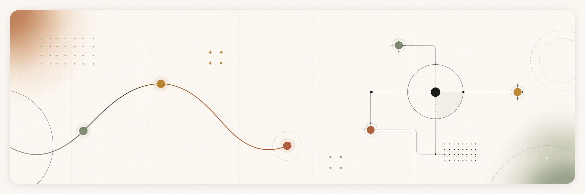
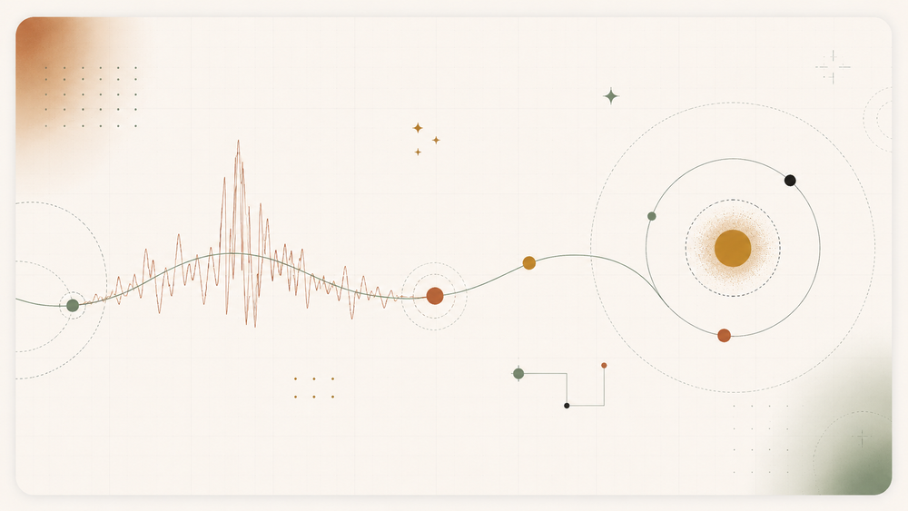
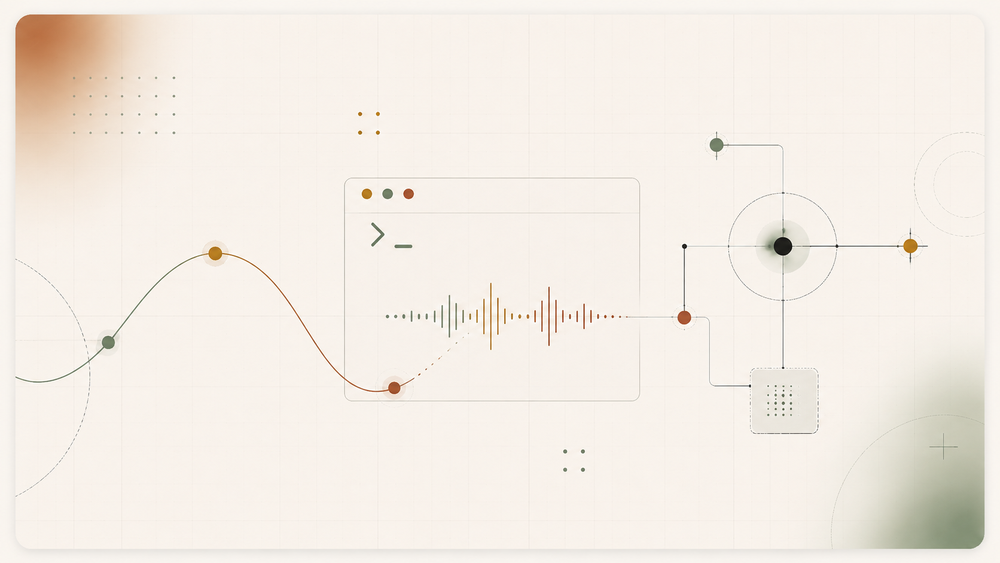
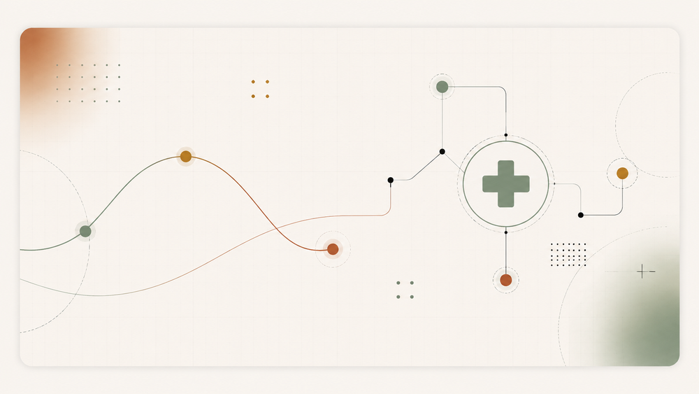
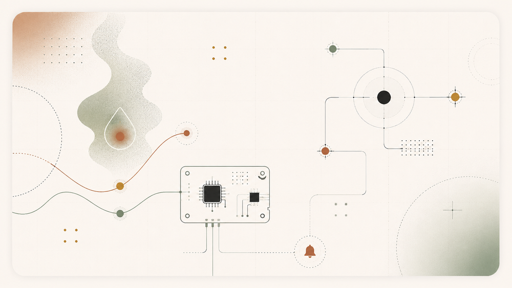
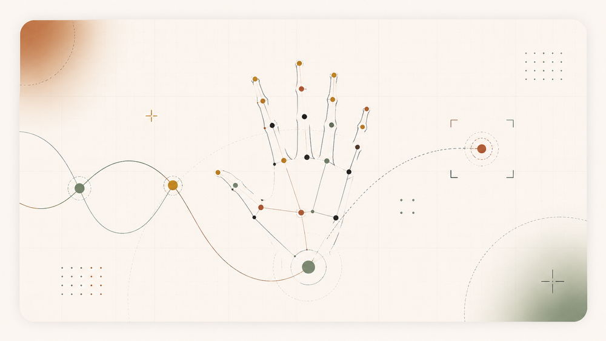
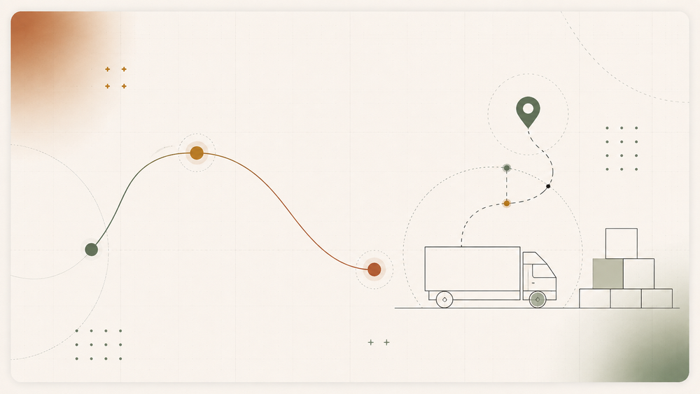

  

<h1 align="center">Parth Patil</h1>

  Software Engineer · AI/ML · Full-stack · IoT

  <a href="https://parth-patil-jade.vercel.app/"><strong>Portfolio</strong></a>
  &nbsp;·&nbsp;
  <a href="https://www.linkedin.com/in/parth-patil-b62809298/"><strong>LinkedIn</strong></a>
  &nbsp;·&nbsp;
  <a href="https://github.com/PATILPARTH1500"><strong>GitHub</strong></a>
  &nbsp;·&nbsp;
  <a href="https://www.instagram.com/parthpatil__150/"><strong>Instagram</strong></a>

 

## About

I build software where **AI, data, hardware and product engineering intersect**.

My work ranges from **solar-flare forecasting with Aditya-L1 data** and **local AI desktop automation** to **health-tech products, computer vision, IoT monitoring systems and production web platforms**.

I care about three things: **clean architecture, measurable results and interfaces people can actually use.**

  

## Selected work

<table>
<tr>
<td width="50%" valign="top">

### TEJAS
**Aditya-L1 Solar Flare Nowcasting & Forecasting**

Scientific ML pipeline combining **SoLEXS soft X-ray** and **HEL1OS hard X-ray** observations for solar-flare detection and forecasting.

**Stack:** Python · Astropy · TCN · LightGBM · Time-series ML

**Results:** ROC-AUC **0.847** · ~**29 min** warning lead time · **97%** GOES class agreement

[View project →](https://github.com/Purvajghude/TEJAS)

</td>
<td width="50%" valign="top">

### VYOM
**Local-first AI Desktop Assistant**

A privacy-focused desktop intelligence layer with local LLMs, voice interaction, automation, task management and system monitoring.

**Stack:** Python · Flask · Ollama · Faster Whisper · SQLite · PyAutoGUI

**Focus:** Local AI · Voice · Desktop automation · Productivity

[View project →](https://github.com/PATILPARTH1500/VYOM)

</td>
</tr>

<tr>
<td width="50%" valign="top">

### MEDIMESH
**Healthcare Access & Insurance Platform**

Health-tech product for patients, doctors and hospitals covering insurer-network discovery, cashless care, claims workflows and healthcare access.

**Stack:** React · Vite · Tailwind CSS · Supabase · PostgreSQL · RLS

**Status:** Smart India Hackathon product build · private development repositories

[View organization →](https://github.com/MEDIMESH-INDIA)

</td>
<td width="50%" valign="top">

### IoT Gas Guard
**Realtime Hazardous-Gas Monitoring**

ESP32-based environmental monitoring system for hazardous gas and air-quality sensing with cloud telemetry and dashboard alerts.

**Stack:** ESP32 · MQ Sensors · DHT · Firebase · Realtime Dashboard

**Focus:** Embedded systems · Telemetry · Alerts · Environmental monitoring

[View project →](https://github.com/PATILPARTH1500/IOT-GAS-GUARD)

</td>
</tr>

<tr>
<td width="50%" valign="top">

### Hand Tracking System
**Realtime Computer Vision Interaction**

Dual-hand tracking system for finger counting, left/right hand detection and pixel-distance measurement from webcam input.

**Stack:** Python · OpenCV · cvzone · Computer Vision

**Focus:** Landmark tracking · Gesture analysis · Realtime vision

[View project →](https://github.com/PATILPARTH1500/HAND-TRACKING-SYSTEM)

</td>
<td width="50%" valign="top">

### Logistics Platform
**Shipping & Service Web Experience**

Responsive logistics website with shipment-oriented UX, service discovery, quote flow and tracking-focused interfaces.

**Stack:** HTML · CSS · JavaScript · Responsive UI

**Focus:** Frontend engineering · Product UX · Logistics workflows

[View project →](https://github.com/PATILPARTH1500/LOGISTICS-WEBSITE)

</td>
</tr>
</table>

  

## Engineering stack

<table>
<tr>
<td width="33%" valign="top">

### Languages
Python  
C++  
JavaScript  
SQL  
HTML / CSS

</td>
<td width="33%" valign="top">

### Product & Backend
React  
Flask  
Supabase  
Firebase  
PostgreSQL  
REST APIs

</td>
<td width="33%" valign="top">

### AI, Data & Hardware
LightGBM  
TCN  
OpenCV  
Ollama  
Astropy  
ESP32  
IoT Sensors

</td>
</tr>
</table>

## What I optimize for

- **Real systems over toy demos** — projects should solve something measurable.
- **Verification over vague claims** — metrics, experiments and reproducible outputs matter.
- **Clean interfaces over clutter** — strong engineering should still feel easy to use.
- **Cross-domain building** — software, AI, embedded systems and scientific data should work together.

## Current direction

I’m going deeper into **AI engineering, intelligent automation, health-tech, IoT and space-tech** while continuing to build full-stack products that can survive scrutiny beyond a hackathon or demo.

 

  <strong>Build it. Measure it. Make the result easy to verify.</strong>

