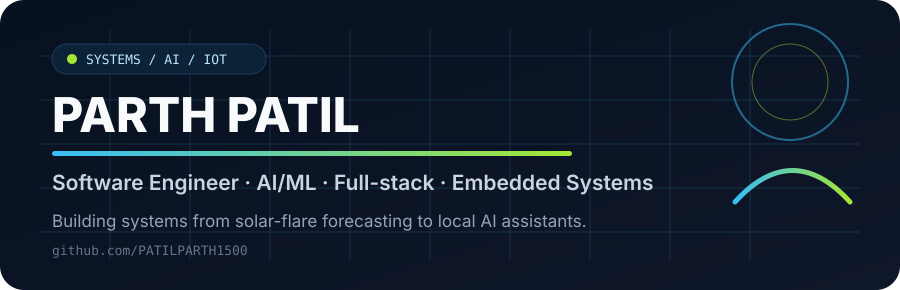
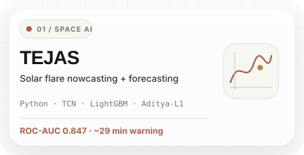
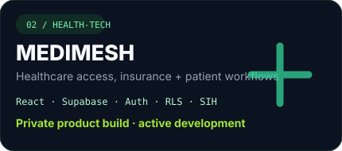
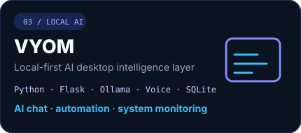
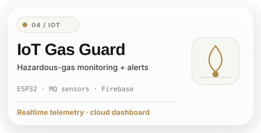
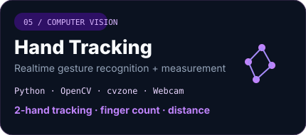
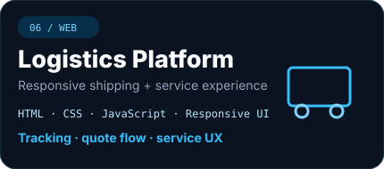
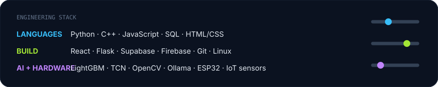

  

  <a href="https://www.linkedin.com/in/parth-patil-b62809298/">LinkedIn</a> ·
  <a href="https://github.com/PATILPARTH1500">GitHub</a> ·
  <a href="https://www.instagram.com/parthpatil__150/">Instagram</a>

## Selected work

| | |
|---|---|
|  |  |
|  |  |
|  |  |

## Engineering stack

  

## What I build

I like projects where **software meets a real system** — scientific data, AI models, hardware, automation, or an end user who actually needs the product.

- **AI / ML systems:** forecasting, computer vision, local LLMs, model evaluation and data pipelines.
- **Full-stack products:** React interfaces, auth, databases, dashboards and backend logic.
- **IoT / embedded prototypes:** ESP32 sensor systems, realtime telemetry and alerting.
- **Engineering approach:** measurable results, reproducible demos, clean architecture and practical UX.

## Current direction

Building toward deeper work in **AI engineering, intelligent automation, health-tech, IoT and space-tech** — with an emphasis on projects that can survive scrutiny beyond the demo.

  Build it. Measure it. Make the result easy to verify.

